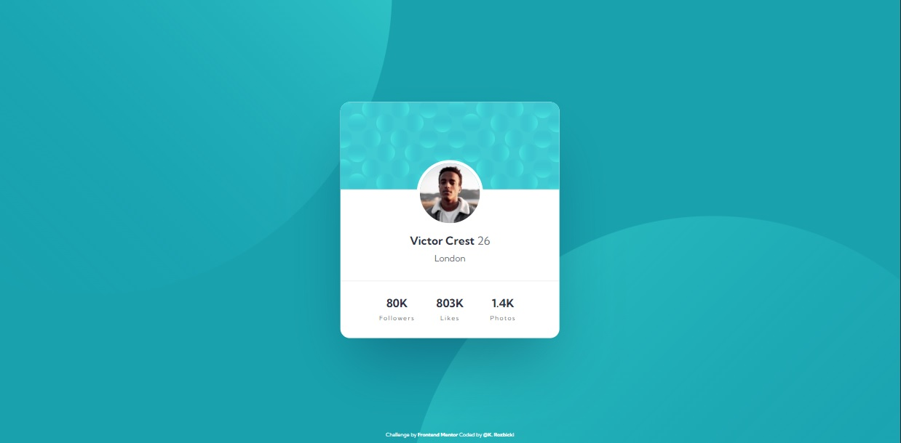

# Frontend Mentor - Profile card component solution

https://krzysztofrozbicki.github.io/fem-challenge-10/

This is a solution to the
[Profile card component challenge on Frontend Mentor](https://www.frontendmentor.io/challenges/profile-card-component-cfArpWshJ).
Frontend Mentor challenges help you improve your coding skills by building realistic projects.

## Table of contents

- [Overview](#overview)
  - [The challenge](#the-challenge)
  - [Screenshot](#screenshot)
  - [Links](#links)
- [My process](#my-process)
  - [Built with](#built-with)
  - [What I learned](#what-i-learned)
  - [Continued development](#continued-development)
  - [Useful resources](#useful-resources)
- [Author](#author)
- [Acknowledgments](#acknowledgments)

## Overview

### The challenge

- Build out the project to the designs provided

### Screenshot



### Links

- [Solution url](https://github.com/KrzysztofRozbicki/fem-challenge-10/)
- [Live site url](https://krzysztofrozbicki.github.io/fem-challenge-10/))

## My process

### Built with

- Semantic HTML5 markup
- CSS custom properties
- Mobile-first workflow

### What I learned

Quite easy project, but I have struggled with responsive background images on body. Finally i
managed to to this with min() and max() functions on background-position;

```css
.body {
  background: url('../images/bg-pattern-top.svg') max(-100vw, -350px) max(-100vw, -500px), url('../images/bg-pattern-bottom.svg')
      min(50vw, 650px) max(10vw, 350px);
  background-repeat: no-repeat;
  background-size: min(165vw, 978px);
  background-color: var(--bg-primary-500);
}
```

### Continued development

I know how the background-image properties work, although I would love to get know how to apply them
with cropped resized images in responsive designs.

### Useful resources

- [CSS Multiple Backgrounds](https://www.w3schools.com/css/css3_backgrounds.asp) - This helped me
  understand how can i apply properties for a few images at the same background.

## Author

- GitHub - [GitHub](https://github.com/KrzysztofRozbicki)
- Website - [Pogbit](https://www.pogbit.com/)
- Frontend Mentor - [@KrzysztofRozbicki](https://www.frontendmentor.io/profile/KrzysztofRozbicki)

## Acknowledgments

Thanks goes to [GoIt](https://goit.global/pl/) for the great course where in just 12 weeks I have
learned almost full HTML/CSS so i can make these challenges without much struggle!
